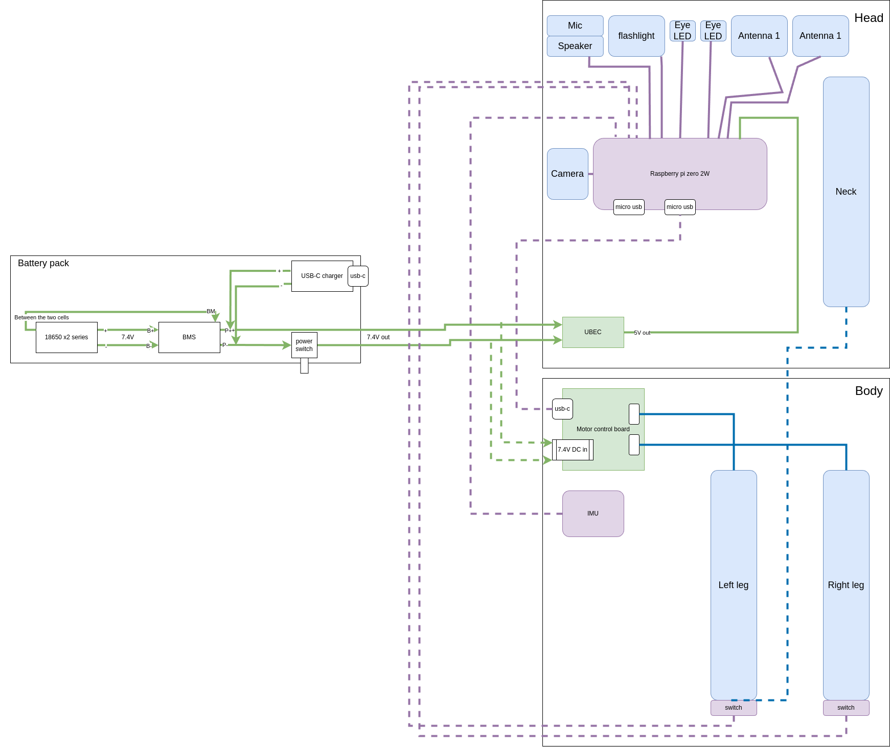

# Assembly guide

> Before assembling the duck, you should first [configure your motors](./configure_motors.md)

## Requirements : 

You will need : 
- A soldering iron, and basic electronics tools and skills
- X m3 screws (TODO : add the exact number)
- Some wire
- Loctite Threadlocker blue 243

> General note : Everytime you screw something in the motors metal against metal, you want to use a little loctite threadlocker. This will prevent the screws from coming loose due to the vibrations during the operation of the robot. It adds a little time to to the build, but you'll be glad you took the time ;)
>
> Don't use loctite with the plastic screws

> At any time, you can refer to the CAD here : https://cad.onshape.com/documents/64074dfcfa379b37d8a47762/w/3650ab4221e215a4f65eb7fe/e/0505c262d882183a25049d05

## Steps :

### Assemble the trunk

Place the bearings in `trunk_bottom` like so, and insert M3 inserts in these holes. It's also a good time to insert the 4 M3 inserts in the bottom of this part to mount body parts later on.

Then assamble `trunk_bottom` and `trunk_top`, and screw them together with 2 `M3x10` screws through these holes

Mount the middle motor like so and screw it with the plastic screws that came with the motors : 

Insert `roll_motor_bottom` like this 

### Assemble the feet

Both feet are the same. 

First, assemble `foot_bottom_tpu` with `foot_bottom_pla`. Insert M3 inserts in these holes :

And screw the two parts together with two `M3x6` screws.

Then, insert M3 inserts in these holes in `foot_top` here : 

And assemble everything like so. Make sure the driver side of the motor is on the `foot_top` part side : 

<table>
  <tr>
    <td>  </td>
    <td>  </td>
   </tr> 
</table>

You can add the foot switches like this too :

> You press fit them so that the switch is activated when the foot touches the ground

<table>
  <tr>
    <td>  </td>
    <td>  </td>
   </tr> 
</table>

### Assemble the shins

Insert M3 Inserts in these holes of `leg_spacer` (on both sides. Insert 4 M3 inserts in total) :

Then, first plug the motor cable in the foot's motor, and make it go through the `right_sheet` like so 

Then assemble like below:

### Assemble the thighs 

The thigh is pretty much the same thing, except the `hip_pitch` motor is mounted this way (important for the zero position)

### Assemble the hips

Mount `left_roll_to_pitch` or `right_roll_to_pitch`, here the parts are symmetrical so you have to use the right one.

Mount `roll_motor_top` to the `hip_yaw` servo (screw from the bottom). Don't mount the servo to the trunk yet.

Then mount `hip_roll` like this 

And insert the sub assembly like this 

Screw everything you can (with the plastic screws provided with the servos)

You can now mount the leg like this :

And do the same for the other leg :)

Your duck should now look like this 

### Assemble the neck

You know the drill

### Assemble the head mechanism

First, mount `head_pitch_to_yaw` like this 

Then, independently mount `head_yaw_to_roll` and `head_roll_mount` to `head_roll dof`

(You can insert `head_bot_plate` and `body_middle_top` now too to avoid having to disassamble the head later)

Then 

Then 

Your duck should now look like this 

### Mount the servo driver board

TODO take a photo

### Mount the IMU

Like this 

> It's actually better to mount the IMU with the correct natural orientation, which would be flipped along the X axis compared to the pictures below
> In the picture below, the IMU is mounted upside down.
> It probably doesn't really matter a lot if you mount it upside down or not. You can configure how you mounted it later

<table>
  <tr>
    <td> </td>
    <td> </td>
   </tr> 
</table>

## Electronics

Here is the global electonics schematic for reference 

<table>
  <tr>
    <td> </td>
    <td> </td>
   </tr> 
</table>

Here is how to wire the feet 

Here is the pin mapping on the Pi Zero header

|       **LEDs**      | **Pi Zero Header Pin** | **Pi Zero Function** |
|:-------------------:|:----------------------:|:--------------------:|
|  Left Eye Anode (+) |           16           |        GPIO 23       |
| Right Eye Anode (+) |           18           |        GPIO 24       |
| Projector Anode (+) |           22           |        GPIO 25       |
|  Common Cathode (-) |            6           |          GND         |
|                     |                        |                      |
|     **Antennas**    |                        |                      |
|       Left PWM      |           32           |     GPIO 12 (PWM)    |
|      Right PWM      |           33           |     GPIO 13 (PWM)    |
|          5V         |            2           |          5V          |
|         GND         |            6           |          GND         |
|                     |                        |                      |
|  **Foot Switches**  |                        |                      |
|      Left Foot      |           15           |        GPIO 22       |
|      Right Foot     |           13           |        GPIO 27       |
|         GND         |            9           |          GND         |
|                     |                        |                      |
|      **BNO055**     |                        |                      |
|         VIN         |            1           |          3V3         |
|         3VO         |           NC           |           -          |
|         GND         |            9           |          GND         |
|         SDA         |            3           |        GPIO 2        |
|         SCL         |            5           |        GPIO 3        |
|         RST         |           NC           |           -          |
|                     |                        |                      |
|    **MAX98357A**    |                        |                      |
|         LRC         |           35           |        GPIO 19       |
|         BCLK        |           12           |        GPIO 18       |
|         DIN         |           40           |        GPIO 21       |
|         GAIN        |           NC           |           -          |
|          SD         |           NC           |           -          |
|         GND         |            6           |          GND         |
|         VIN         |            2           |          5V          |

### Battery pack

> To be safe, make sure your cells are charged to the same voltage before placing them in the holder.

<table>
  <tr>
    <td> </td>
    <td> </td>
   </tr> 
</table>

### Head

First, insert the M3 inserts in all these holes 

> TODO add instructions for expression features (camera, antennas, eye leds, projector and speaker)

Then insert the bearing, mount the ear motors and the raspberry pi zero 2w.

For reference, the inside of the head looks like this now 

Then assemble the neck with the head like this

## Body

First screw on `body_middle_bottom`

Then insert the M3 inserts in all the holes of `body_middle_bottom` and `body_middle_top` on which we'll mount the battery pack and `body_front`.

Then mount `body_middle_top`, `body_front` and the battery pack

<table>
  <tr>
    <td> </td>
    <td> </td>
   </tr> 
</table>

Et voila :) 

<table>
  <tr>
    <td> </td>
    <td> </td>
   </tr> 
</table>

> Now that your duck is fully assembled, you setup the raspberry pi and the runtime software [here](https://github.com/apirrone/Open_Duck_Mini_Runtime)
